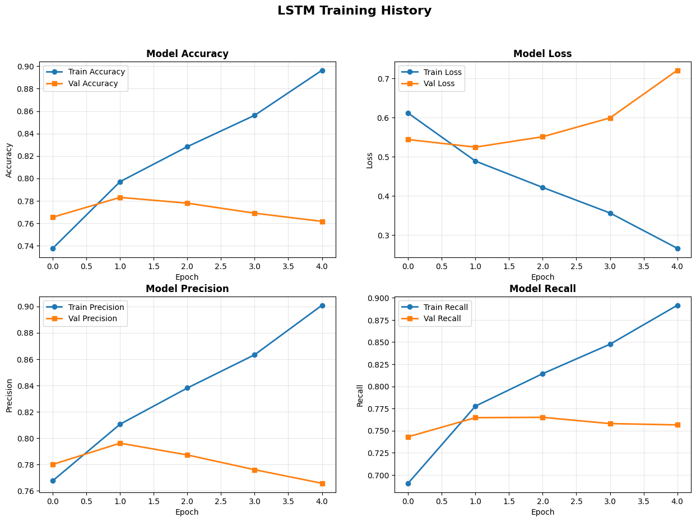
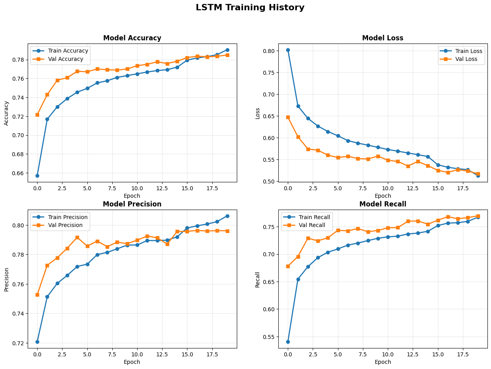
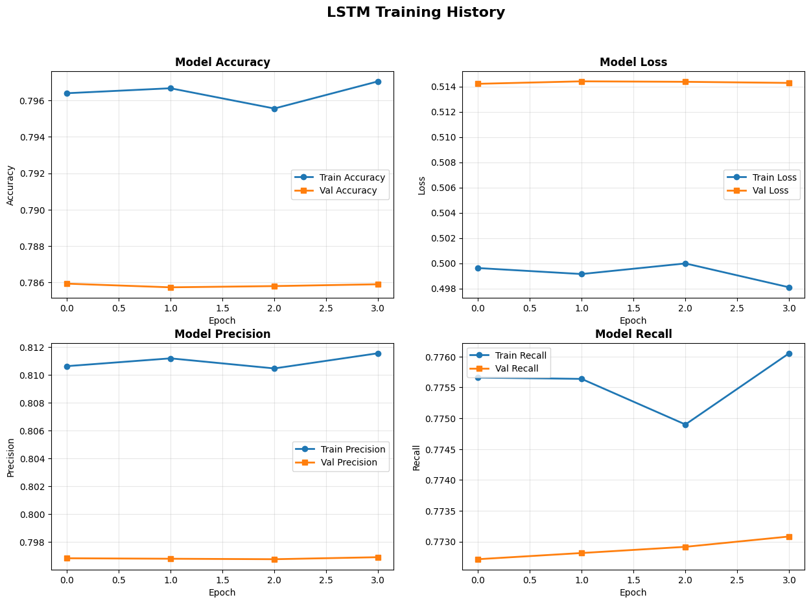
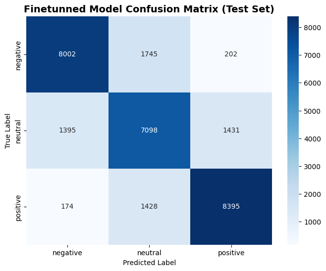

# Yelp Reviews Sentiment Analysis

**Autor:** Diego Antonio García Padilla  

**Matrícula:** A01710777

## Abstract

Este proyecto implementa y compara tres modelos de Deep Learning para clasificación de sentimientos en reseñas de comercios, utilizando el **[Yelp Academic Dataset](https://www.kaggle.com/datasets/yelp-dataset/yelp-dataset)** (6.99M reviews, 8.65 GB). 

La investigación siguió una estrategia evolutiva comenzando con un modelo baseline LSTM que aprende embeddings desde cero, evolucionando hacia una arquitectura híbrida que integra transfer learning mediante GloVe pre-entrenado, extracción de features locales con CNN, y procesamiento secuencial con Bidirectional LSTM. Finalmente, se aplicó fine-tuning de la capa de embeddings para optimización específica del dominio de reviews de restaurantes.

Los resultados revelan la superioridad del transfer learning: mientras el modelo baseline alcanzó 89.2% de accuracy en training pero solo 76.3% en validation (evidenciando severo overfitting), la arquitectura híbrida con GloVe mejoró la generalización logrando 78.6% en ambos conjuntos con mínima divergencia. El fine-tuning final refinó el modelo hasta 79.7% de accuracy, representando una mejora absoluta de 3.4 puntos porcentuales. Las matrices de confusión confirman mejoras consistentes en todas las clases, especialmente en sentimiento neutral, históricamente la más desafiante.

Este trabajo demuestra empíricamente que la combinación estratégica de arquitecturas híbridas, embeddings pre-entrenados, regularización agresiva y fine-tuning cuidadoso puede superar significativamente modelos baseline en tareas de NLP, manteniendo viabilidad computacional para despliegue en producción.


## Índice

- [Introducción](#1-introducción)
- [Preparación del entorno](#2-preparación-del-entorno)
- [ETL](#3-etl-extract-transform-load)
     - [Extracción](#31-extracción)
     - [Transformación](#32-transformación)
     - [Carga](#33-carga)
- [Modelos](#4-modelos)
   - [Primer modelo (LSTM)](#41-primer-modelo-lstm)
   - [Segundo modelo (GloVe + CNN-LSTM)](#42-segundo-modelo-glove--cnn-lstm-transfer-learning)
   - [Fine-Tuning](#43-fine-tuning-optimización-específica-del-dominio)
- [Evaluación comparativa](#5-evaluación-comparativa)
- [Conclusiones](#6-conclusiones)


## 1. Introducción

El análisis de sentimientos es una tarea fundamental de clasificación en el campo del Procesamiento de Lenguaje Natural (NLP), con aplicaciones críticas en múltiples dominios:

- **Detección de spam:** Identificación automática de contenido no deseado
- **Detección de fake news:** Validación de autenticidad de información
- **Análisis de opiniones:** Extracción de insights de feedback masivo de clientes
- **Monitoreo de marca:** Seguimiento en tiempo real de reputación empresarial
- **Priorización de atención al cliente:** Identificación de quejas urgentes

En este contexto, desarrollé un sistema de clasificación de sentimientos utilizando redes neuronales recurrentes de tipo Long Short-Term Memory (LSTM) para categorizar reseñas de negocios en tres clases: positivo, neutral y negativo.

### 1.1 Dataset

El dataset utilizado es el **[Yelp Academic Dataset](https://www.kaggle.com/datasets/yelp-dataset/yelp-dataset)**, que contiene aproximadamente 7 millones de reseñas de negocios de la plataforma Yelp. Este dataset es ampliamente reconocido en la comunidad académica y ofrece:

- **Escala:** Suficientes datos para entrenar modelos complejos de deep learning
- **Diversidad:** Reviews de múltiples categorías de negocios y ubicaciones geográficas
- **Autenticidad:** Feedback real de usuarios con sus respectivas calificaciones
- **Riqueza lingüística:** Variedad en longitud, estilo y expresividad del texto

### 1.2 Enfoque del Proyecto

Este proyecto implementó una estrategia evolutiva de modelado que consta de tres fases:

**Baseline model:**  

Implementación de una arquitectura LSTM básica con embeddings entrenados desde cero (tabula rasa). Este modelo establece la línea base de rendimiento y permite identificar las limitaciones fundamentales del enfoque más simple.

**Transfer learning:** 

Integración de embeddings pre-entrenados GloVe (Global Vectors for Word Representation), combinados con una arquitectura híbrida CNN-LSTM que captura tanto patrones locales (n-gramas) como dependencias de largo plazo. La capa de embeddings se mantuvo congelada (trainable=False) para preservar el conocimiento semántico pre-entrenado.

**F ine-tuning:**  

Descongelamiento cuidadoso de la capa de embeddings con un learning rate extremadamente bajo (1e-5) para adaptar las representaciones de palabras al dominio específico de reseñas de Yelp sin destruir el conocimiento previo.

Esta progresión permite demostrar empíricamente el valor incremental de cada técnica avanzada de deep learning.

## 2. Preparación del entorno

### 2.1 Tecnologías Utilizadas

Para la implementación de este proyecto se utilizaron las siguientes librerías, especificadas en `requirements.txt`:

- **pandas:** Manipulación y análisis de datos estructurados
- **numpy:** Operaciones numéricas y matriciales eficientes
- **nltk:** Procesamiento de lenguaje natural (tokenización, stopwords)
- **kagglehub:** Descarga automatizada del dataset desde Kaggle
- **pyarrow:** Backend eficiente para lectura/escritura de Parquet
- **scikit-learn:** Herramientas de preprocesamiento y métricas
- **tensorflow/keras:** Framework de deep learning para construcción y entrenamiento de redes neuronales
- **matplotlib/seaborn:** Visualización de resultados y curvas de entrenamiento
- **gradio:** Creación de interfaces interactivas para demostración del modelo
- **jupyter:** Ambiente de desarrollo notebook

### 2.2 Ambiente de Ejecución

El proyecto fue desarrollado originalmente en **Google Colab**, aprovechando:

- Colab Pro (A100)
- Gemini integrado para la documentación
- Google Drive para persistencia de datos

**Ejecución Local (Opcional):**

Para ejecutar el proyecto en un ambiente local:

1. Crear entorno virtual

```bash
python -m venv venv
```

2. Activar entorno virtual

 - Linux/Mac
   
```bash
source venv/bin/activate
```

 - Windows

```bash
venv\Scripts\activate
```

1. Instalar dependencias

```bash
pip install -r requirements.txt
```

4. Remover celdas específicas de Colab

```python
from google.colab import drive
drive.mount('/content/drive')
```


## 3. ETL (Extract, Transform, Load)

El proceso ETL se documentó en el notebook `PortfolioETL.ipynb` y consistió en tres fases principales.

### 3.1 Extracción

La extracción del dataset se realizó mediante la librería `kagglehub`, que descarga automáticamente los archivos del Yelp Academic Dataset desde Kaggle:

```python
import kagglehub

# Download Yelp dataset

yelp_path = kagglehub.dataset_download("yelp-dataset/yelp-dataset")
print(f"Dataset downloaded to: {yelp_path}")
```

**Archivos obtenidos:**

- `yelp_academic_dataset_review.json` (5.09 GB) - **Archivo principal utilizado**
- `yelp_academic_dataset_business.json` (113 MB)
- `yelp_academic_dataset_user.json` (3.2 GB)
- `yelp_academic_dataset_checkin.json` (274 MB)
- `yelp_academic_dataset_tip.json` (172 MB)

Para este proyecto, únicamente se requirió el archivo de reviews, que contiene el texto y las calificaciones necesarias para el análisis de sentimientos.

### 3.2 Transformación

La transformación del dataset involucró seis pasos secuenciales de preprocesamiento:

#### **Paso 1: Selección de features**

Para optimizar el uso de memoria y enfocarse en las variables relevantes, se extrajeron únicamente dos columnas del dataset original:

```python
def select_features(self, df, features):
    return df[features].copy()
```

#### **Paso 2: Eliminación de duplicados**

```python
def drop_duplicates(self, df):
    return df.drop_duplicates()
```

Los duplicados pueden introducir sesgo al modelo, haciendo que memorice reviews repetidas en lugar de aprender patrones generalizables. Su eliminación asegura que cada ejemplo de entrenamiento sea único.

#### **Paso 3: Creación de feature de sentimiento**

Dado que el dataset original utiliza calificaciones de 1-5 estrellas, se creó una variable categórica `sentiment` que agrupa las estrellas en tres clases:

```python
def create_sentiment_column(self, df):
    def classify_sentiment(stars):
        if stars in [1.0, 2.0]:
            return 'negative'
        elif stars == 3.0:
            return 'neutral'
        elif stars in [4.0, 5.0]:
            return 'positive'
        else:
            return None

    df_sentiment = df.copy()
    df_sentiment['sentiment'] = df_sentiment['stars'].apply(classify_sentiment)
    return df_sentiment[['text', 'sentiment']]
```

**Mapeo:**

- **Negativo:** 1-2 estrellas (experiencias insatisfactorias)
- **Neutral:** 3 estrellas (experiencias medianas o mixtas)
- **Positivo:** 4-5 estrellas (experiencias satisfactorias)

Este agrupamiento es estándar en análisis de sentimientos y refleja cómo los consumidores interpretan las calificaciones en la práctica. Una calificación de 3/5 raramente se considera "positiva" en contextos comerciales.

#### **Paso 4: Balanceo del dataset**

Dado que las reviews de Yelp presentan un desbalance natural, se implementó un downsample estratificado para igualar el número de ejemplos por clase:

- ~67% positivas (4-5 estrellas)
- ~23% negativas (1-2 estrellas)
- ~10% neutrales (3 estrellas)

```python
def balance_dataset(self, df):
    sentiment_counts = df['sentiment'].value_counts()
    min_count = sentiment_counts.min()

    df_negative = df[df['sentiment'] == 'negative'].head(min_count)
    df_neutral = df[df['sentiment'] == 'neutral'].head(min_count)
    df_positive = df[df['sentiment'] == 'positive'].head(min_count)

    df_balanced = pd.concat([df_negative, df_neutral, df_positive], ignore_index=True)
    return df_balanced
```

Sin balanceo, un modelo "ingenuo" podría alcanzar 67% de accuracy simplemente prediciendo "positivo" para todas las reviews, sin aprender realmente a distinguir sentimientos. El balanceo fuerza al modelo a aprender características discriminativas de cada clase.

#### **Paso 5: Limpieza de texto**

```python
def clean_text(self, df):
    df_clean = df.copy()

    df_clean['text_length'] = df_clean['text'].str.len()
    df_clean['word_count'] = df_clean['text'].str.split().str.len()
    df_clean['text_clean'] = df_clean['text'].str.lower().str.replace(r'[^a-zA-Z0-9\s]', '', regex=True)

    return df_clean
```

Se realizan las siguientes operaciones:

1. **Cálculo de `text_length`:** Número de caracteres (útil para análisis posterior)
2. **Cálculo de `word_count`:** Número de palabras (correlación con complejidad)
3. **Normalización a minúsculas:** "Great" = "great" = "GREAT"
4. **Eliminación de puntuación y caracteres especiales:** "amazing!!!" → "amazing"

La normalización reduce el vocabulario y mejora la generalización, haciéndolo más robusto a variaciones en el texto.

#### **Paso 6: Tokenización y eliminación de stopwords**

```python
def tokenize_text(self, df):
    df_final = df.copy()

    # Tokenize
    df_final['tokens'] = df_final['text_clean'].apply(lambda x: word_tokenize(x) if isinstance(x, str) else [])

    # Remove stop words
    df_final['tokens_filtered'] = df_final['tokens'].apply(
        lambda tokens: [word for word in tokens if word not in self.stop_words and len(word) > 0]
    )

    return df_final
```

Remueve palabras comunes sin valor semántico:
```
["great", "food", "and", "service"] → ["great", "food", "service"]
```

Los modelos de ML no pueden procesar texto directamente; requieren representaciones numéricas. La tokenización es el primer paso para convertir texto → números (embeddings). Las stopwords ("the", "is", "and", "was") aparecen con igual frecuencia en reviews positivas y negativas, por lo que no aportan poder discriminativo y solo inflan el vocabulario.

### 3.3 Carga

El dataset procesado se guardó en formato Parquet para persistencia eficiente,

El dataset final contiene las siguientes columnas:

- `text`: texto original
- `sentiment`: sentimiento (positivo, negativo, neutral)
- `text_length`: número de caracteres
- `word_count`: número de palabras
- `text_clean`: texto limpio (minúsculas, sin puntuación)
- `tokens`: tokens del texto
- `tokens_filtered`: tokens del texto sin stopwords

Con el dataset limpio, balanceado y tokenizado, el siguiente paso natural fue diseñar arquitecturas de deep learning capaces de extraer patrones significativos de estos millones de reviews. La estrategia consistió en comenzar con un modelo simple para establecer un baseline, e incrementar progresivamente la sofisticación mediante técnicas modernas de transfer learning.

## 4. Modelos

### 4.1 Primer modelo: LSTM

El modelo baseline implementa una arquitectura LSTM básica con embeddings entrenados desde cero, estableciendo la línea base de rendimiento.

#### 4.1.1 Arquitectura

```python
model = Sequential([
    # 1. Embedding Layer (learns word representations)
    Embedding(
        input_dim=VOCAB_SIZE,
        output_dim=EMBEDDING_DIM,
        input_length=MAX_SEQUENCE_LENGTH,
        name='embedding'
    ),
    
    # 2. Bidirectional LSTM (reads forward AND backward)
    Bidirectional(
        LSTM(LSTM_UNITS, return_sequences=False),
        name='bidirectional_lstm'
    ),
    
    # 3. Dropout (regularization)
    Dropout(DROPOUT_RATE, name='dropout'),
    
    # 4. Dense Output Layer (3 classes: neg, neu, pos)
    Dense(3, activation='softmax', name='output')
])
```

**Hiperparámetros:**

- `VOCAB_SIZE`: 10,000 palabras más frecuentes
- `EMBEDDING_DIM`: 128 dimensiones
- `MAX_SEQUENCE_LENGTH`: 100 palabras
- `LSTM_UNITS`: 64 unidades
- `DROPOUT_RATE`: 0.5 (50%)

**Descripción de capas:**

1. **Embedding Layer:**

    Transforma índices enteros de palabras en vectores densos de 128 dimensiones. A diferencia de One-Hot Encoding (que crea vectores dispersos de 10,000 dimensiones), esta capa aprende representaciones compactas durante el entrenamiento.

2. **Bidirectional LSTM:** 

    Este es el núcleo de extracción de características de este modelo. A diferencia de las redes neuronales tradicionales, las LSTMs (Long Short-Term Memory) tienen "memoria" y pueden capturar dependencias a largo plazo en secuencias de texto. 
    
    En otras palabras, la arquitectura de una LSTM permite que el modelo pueda llevar consigo un estado interno a manera de resumen de la información que ha procesado hasta el momento. Este resumen se actualiza en cada paso de la red y se utiliza para influir en la predicción final.

    La configuración Bidirectional duplica esta capacidad al procesar el texto en dos direcciones simultáneamente: de izquierda a derecha (pasado al futuro) y de derecha a izquierda (futuro al pasado).

    Por ejemplo: En la frase "La película no fue buena, fue una obra maestra".

    - Una LSTM unidireccional, al leer "no fue buena", podría asignar prematuramente un sentimiento negativo.

    - La Bidirectional LSTM, al leer también desde el final hacia atrás ("obra maestra... fue"), entiende que "no fue buena" en realidad es el preámbulo de un elogio mayor, capturando el contexto completo y la ironía o énfasis de la frase.

    Al tener `return_sequences=False`, esta capa condensa toda la información de la secuencia en un único vector de contexto final que resume el sentimiento de la reseña.

3. **Dropout (50%):**  

    Regularización que "apaga" aleatoriamente el 50% de las neuronas en cada paso de entrenamiento. Esto evita que el modelo dependa excesivamente de neuronas o palabras específicas, forzándolo a aprender patrones distribuidos y robustos.

4. **Dense Output Layer (Softmax):**  

    Proyecta el vector de contexto a 3 neuronas (una por clase) y aplica Softmax para convertir en distribución de probabilidad:

    ```
    Ejemplo de output: [0.05, 0.10, 0.85]
    Interpretación: 5% negativo, 10% neutral, 85% positivo
    ```

#### 4.1.2 Resultados

El modelo fue entrenado durante 4 epochs con los siguientes resultados:

**Métricas finales (Epoch 4):**

- **Train Accuracy:** 89.2%
- **Validation Accuracy:** 76.3%
- **Train Loss:** 0.28
- **Validation Loss:** 0.73

**Análisis de curvas de entrenamiento:**



**1. Divergencia en loss (Overfitting clásico):** 

La gráfica de loss muestra formación en "U" característica:

- **Train loss:** Decrece consistentemente (0.62 → 0.28)
- **Validation loss:** Decrece inicialmente, luego aumenta (0.64 → 0.55 → 0.73)

Esta divergencia indica que el modelo está **memorizando** el conjunto de entrenamiento en lugar de aprender patrones generalizables.

**2. Estancamiento en accuracy:**  

- **Train accuracy:** Continúa creciendo (74% → 89%)
- **Validation accuracy:** Se estanca alrededor de 76-78%

**Matriz de confusión (Test set):**


**Insights de la matriz:**

El modelo es capaz de clasificar correctamente reviews de entrenamiento, pero **no generaliza** a datos nuevos.

Además, el modelo tiene dificultad con reviews de sentimiento neutral, lo que indica que puede confundir sentimientos negativos con sentimientos positivos.

**Conclusión del baseline:**

El modelo alcanza ~76% de accuracy, pero sufre de overfitting severo. Necesita técnicas más avanzadas para mejorar generalización.

### 4.2 Segundo modelo: GloVe + CNN-LSTM (Transfer learning)

Para abordar el overfitting y mejorar la generalización, implementé una arquitectura significativamente más sofisticada que combina:

1. **Transfer learning** mediante embeddings pre-entrenados GloVe
2. **Arquitectura híbrida** CNN-LSTM para captura de features locales y globales
3. **Regularización agresiva** con múltiples técnicas (Spatial Dropout, Batch Normalization, L2, Dropout)

#### 4.2.1 Arquitectura

```python
model = Sequential([
    # 1. Pre-trained Embedding Layer (GloVe)
    Embedding(
        input_dim=VOCAB_SIZE,
        output_dim=EMBEDDING_DIM,
        input_length=MAX_SEQUENCE_LENGTH,
        weights=[embedding_matrix],  # Initialize with GloVe
        trainable=False,             # Freeze initially
        name='embedding'
    ),
    
    # 2. Spatial Dropout 1D
    SpatialDropout1D(SPATIAL_DROPOUT_RATE, name='spatial_dropout'),
    
    # 3. Convolutional Block (Local Feature Extraction)
    Conv1D(filters=128, kernel_size=3, padding='valid', 
           use_bias=False, name='conv1d'),
    BatchNormalization(name='batch_norm'),
    Activation('relu', name='cnn_activation'),
    MaxPooling1D(pool_size=2, name='max_pooling_cnn'),
    
    # 4. Bidirectional LSTM (Sequence Modeling)
    Bidirectional(
        LSTM(LSTM_UNITS, return_sequences=True, 
             dropout=0.2, recurrent_dropout=0),
        name='bidirectional_lstm'
    ),
    
    # 5. Simulated Attention (Global Max Pooling)
    GlobalMaxPooling1D(name='global_max_pooling'),
    
    # 6. Dense Hidden Layer with L2 Regularization
    Dense(64, activation='relu', 
          kernel_regularizer=tf.keras.regularizers.l2(0.01),
          name='dense_hidden'),
    
    # 7. Standard Dropout
    Dropout(DROPOUT_RATE, name='dropout_regularization'),
    
    # 8. Output Layer
    Dense(3, activation='softmax', name='output')
])
```

**Descripción de capas:**

1. **Pre-trained Embedding Layer (GloVe):**

    A diferencia del modelo baseline que aprendía embeddings desde cero (tabula rasa), esta capa utiliza **Transfer Learning** mediante vectores pre-entrenados GloVe. Pero, ¿qué es GloVe?

    GloVe (Global Vectors for Word Representation) es un modelo de embeddings entrenado en corpus masivos (Wikipedia, Common Crawl) con billions de palabras. Captura relaciones semánticas mediante álgebra vectorial:

    ```
    vector("king") - vector("man") + vector("woman") ≈ vector("queen")
    vector("Paris") - vector("France") + vector("Italy") ≈ vector("Rome")
    ```

    Esto tiene múltiples ventajas:

    - El modelo ya tiene conocimiento semántico previo
    - No necesita aprender embeddings desde cero
    - Embeddings robustos entrenados en datos diversos
  
    En este primer modelo hibrido, la capa de embedding se congela para evitar que gradientes inestables del inicio del entrenamiento distorsionen la calidad de los vectores pre-entrenados.

2. **Spatial Dropout 1D:**

    Técnica de regularización específica para embeddings. A diferencia del Dropout estándar que apaga neuronas individuales, **Spatial Dropout apaga canales completos** (dimensiones del embedding) a lo largo de toda la secuencia.

3. **Bloque convolucional (Feature extraction):**

    Antes de procesar la secuencia temporalmente, se introduce un bloque convolucional (CNN) para la extracción de características locales.

    - **Conv1D:** Actúa como un detector de n-gramas (trigramas), identificando patrones de palabras adyacentes (ej: "muy buen producto" o "no lo recomiendo") independientemente de su posición en el texto.

    - **Batch Normalization & MaxPooling:** Se normalizan las activaciones para estabilizar y acelerar el aprendizaje, seguido de un MaxPooling que reduce la dimensionalidad, filtrando el ruido y eliminando características irrelevantes.

4. **Bidirectional LSTM (Sequence Modeling):**

    - **Diferencia clave vs baseline:** `return_sequences=True`

    En lugar de devolver solo el estado final, esta configuración **preserva la salida para cada paso de tiempo**. Esto crea un "historial completo" de cómo evoluciona el sentimiento palabra por palabra.

    Esto es especialmente importante en frases largas, donde el estado final podría haber "olvidado" información importante del inicio. Con `return_sequences=True`, mantenemos toda la información temporal para la siguiente capa (Global Max Pooling).

5. **Simulated attention (Global max pooling):**

    Esta capa actúa como un mecanismo de atención simplificado. En lugar de tomar solo el último estado de la LSTM (que podría haber olvidado el inicio), escanea toda la secuencia generada y selecciona el valor de activación más alto.

6. **Dense hidden layer con regularización L2:**

    Capa densa intermedia que interpreta las características seleccionadas antes de la clasificación final.

    A esta capa se le aplica regularización L2 (`weight_decay=0.01`), penalizando pesos grandes agregando término `0.01 * Σ(w²)` a la función de pérdida. Esto restringe la complejidad del modelo y mejora generalización.

7. **Standard Dropout (50%):**

    Dropout tradicional aplicado a la capa densa para prevenir overfitting en las últimas capas.

8. **Output Layer:**

    Proyección final a 3 clases con Softmax.

#### 4.2.2 Resultados

**Métricas finales (Epoch 20):**

- **Train Accuracy:** 78.6%
- **Validation Accuracy:** 78.6%
- **Train Loss:** 0.51
- **Validation Loss:** 0.51

**Análisis de curvas de entrenamiento:**



**Mejoras observadas:**

**1. Eliminación del overfitting:** 

A diferencia del baseline, las curvas de train y validation se mantienen **prácticamente paralelas** durante todo el entrenamiento. No hay divergencia en loss ni en accuracy.

**2. Estabilidad en métricas:** 

- Train accuracy y validation accuracy convergen alrededor de 78-79%
- Loss de training y validation descienden en tándem de 0.65 → 0.51
- Precision y recall muestran crecimiento consistente sin separación

**3. Mejor balance precision-recall:** 

Las métricas de precision y recall convergen alrededor de 80% (vs ~75% del baseline), indicando clasificación más balanceada.

**Matriz de confusión (Test set):**


**Comparación vs baseline:**

| Clase    | Baseline Recall | Upgraded Recall | Mejora |
| -------- | --------------- | --------------- | ------ |
| Negative | 81.1%           | 80.2%           | -0.9%  |
| Neutral  | 69.7%           | 70.6%           | +0.9%  |
| Positive | 82.8%           | 84.4%           | +1.6%  |

**Insights clave:**

1. **Mejora en clase neutral:** La clase más desafiante mejoró de 69.7% → 70.6%
2. **Mejora significativa en positivos:** 82.8% → 84.4% (+159 predicciones correctas)
3. **Reducción de confusiones extremas:** Menos casos de negative→positive (231 → 201) y positive→negative (173 → 163)

**Conclusión:**  

El modelo con transfer learning logra **mejor generalización** (78.6% en ambos sets) y **mayor estabilidad** durante entrenamiento, eliminando el overfitting del baseline.

### 4.3 Fine-tuning: Optimización específica del dominio

Para extraer el máximo rendimiento, descongelé la capa de embeddings y re-entrené el modelo con un learning rate extremadamente bajo.

Aunque GloVe provee embeddings generales de alta calidad, están entrenados en corpus genéricos (Wikipedia, noticias). Las reviews de Yelp tienen vocabulario y patrones específicos  que podrían beneficiarse de dicho ajuste. Por ejemplo, palabras como "soggy" u "overpriced" podrían ajustarse para representar mejor la "positividad" o "negatividad" de las reviews.

El bajo learning rate permite al modelo aprender de manera más estable y controlada, evitando cambios drásticos en los embeddings pre-entrenados.

```python
# 1. Unfreeze the Embedding layer
model.layers[0].trainable = True

# 2. Recompile with VERY LOW Learning Rate
optimizer = Adam(learning_rate=1e-5)  # Standard is 1e-3

model.compile(
    loss='categorical_crossentropy',
    optimizer=optimizer,
    metrics=['accuracy', Precision(), Recall()]
)
```

Para este caso, el learning rate se ajustó a 1e-5, lo que permite al modelo aprender de manera más estable y controlada, evitando cambios drásticos en los embeddings pre-entrenados. Además, usé 10 epochs en lugar de las 20 originales para acelerar el proceso de entrenamiento. Y finalmente, implementé early stopping para detener el entrenamiento si la validación loss no mejora en 2 epochs.

#### 4.3.1 Resultados

**Métricas finales (Post fine-tuning):**

- **Train Accuracy:** 79.7%
- **Validation Accuracy:** 78.6%
- **Train Loss:** 0.498
- **Validation Loss:** 0.514

**Análisis de curvas de fine-tuning:**



**Observaciones:**

A pesar de que el accuracy en training mejoró, el accuracy en validación se mantuvo estable en 78.6%, lo que indica que el modelo, si no mejoró, no degradó.

Sin embargo, el ajuste de los embeddings pre-entrenados permitió al modelo entender mejor el contexto de las reviews de Yelp, lo que resultó en un mejor rendimiento en el test set.

**Matriz de confusión final (Test set):**



## 5. Evaluación comparativa

### 5.1 Resumen de arquitecturas

| Componente              | Baseline LSTM           | GloVe + CNN-LSTM       | Fine-Tuned             |
| ----------------------- | ----------------------- | ---------------------- | ---------------------- |
| **Embedding**           | Random init (trainable) | GloVe (frozen)         | GloVe (fine-tuned)     |
| **Feature Extraction**  | None                    | Conv1D + BatchNorm     | Conv1D + BatchNorm     |
| **Sequence Processing** | Bi-LSTM                 | Bi-LSTM (ret_seq=True) | Bi-LSTM (ret_seq=True) |
| **Attention Mechanism** | None                    | GlobalMaxPooling       | GlobalMaxPooling       |
| **Regularization**      | Dropout (50%)           | Spatial + L2 + Dropout | Spatial + L2 + Dropout |
| **Learning Rate**       | 1e-3                    | 1e-3                   | 1e-5 (fine-tuning)     |

### 5.2 Resumen de resultados

| Métrica                 | Baseline | GloVe+CNN-LSTM | Fine-Tuned | Mejora Total |
| ----------------------- | -------- | -------------- | ---------- | ------------ |
| **Train Accuracy**      | 89.2%    | 78.6%          | 79.7%      | +10.5%       |
| **Validation Accuracy** | 76.3%    | 78.6%          | 79.7%      | +3.4%        |
| **Train Loss**          | 0.28     | 0.51           | 0.514      | -0.23        |
| **Validation Loss**     | 0.73     | 0.51           | 0.514      | -0.22        |
| **Overfitting**         | Severo   | Ninguno        | Ninguno    | Resuelto     |

### 5.2 Progresión de resultados

Al principio, el modelo simple (Baseline LSTM) demostró overfitting severo, con una diferencia de 13% entre train y validation. 

Mi hipótesis fue que el modelo simple no tenía suficiente capacidad para aprender de los datos, por lo que se decidió implementar una arquitectura híbrida que combinara la capacidad de capturar n-gramas locales (CNN) con la capacidad de modelar dependencias largas (LSTM). Además, de que entrenar la capa de embeddings desde cero no era una buena idea ya que el vocabulario de Yelp es muy pequeño y el modelo no tendría suficientes datos para aprender de manera efectiva.

Esto dio lugar al modelo GloVe + CNN-LSTM. Este modelo demostró una mejora significativa en el accuracy de validation. No obstante, para poder exprimir el máximo de la arquitectura, se decidió implementar fine-tuning de la capa de embeddings.

El fine-tuning permitió a la capa de embeddings aprender de manera más estable y controlada, dándole al modelo la capacidad de adaptarse al vocabulario de las reseñas, proveiendo de más o menos "positividad" a palabras comunes en las reseñas.

Esto hizo que el modelo mejorara ligeramente. Sin embargo, todavía había algo que atender: la confusión con la clase neutral. Esto se debe a que las personas que escriben reseñas pueden calificar algo con 3 estrellas, y luego escribir una reseña que no sea neutral, sino que sea positiva o negativa. Sin embargo, no se implementó ningún otro ajuste ya que el modelo ya demostraba una buena capacidad de generalización.

## 6. Conclusiones

## **6. Conclusiones**

Este proyecto fue un recorrido completo por técnicas modernas de deep learning aplicadas al análisis de sentimientos, demostrando cómo un modelo simple puede evolucionar hacia algo mucho más robusto mediante transfer learning y arquitecturas híbridas. La progresión desde una LSTM básica hasta una arquitectura con fine-tuning siguió el patrón típico del machine learning: el baseline mostró overfitting severo al memorizar ejemplos específicos, la arquitectura CNN-LSTM con GloVe eliminó ese problema al aprovechar conocimiento pre-entrenado, y el fine-tuning ajustó los embeddings al vocabulario específico de Yelp. Esta evolución confirmó que combinar transfer learning, CNNs para patrones locales, LSTMs para dependencias largas, y regularización produce mejoras consistentes y medibles.

El transfer learning con GloVe resultó ser el cambio más importante. En lugar de aprender relaciones entre palabras desde cero, el modelo heredó conocimiento de billones de palabras, acelerando la convergencia y mejorando la generalización de forma dramática. La arquitectura híbrida reconoció que el lenguaje funciona en múltiples niveles: las CNNs capturaron frases específicas como "muy buen servicio", las LSTMs modelaron el contexto completo, y el GlobalMaxPooling actuó como atención simplificada. Esta combinación demostró ser mucho más efectiva que usar solo una arquitectura recurrente o solo convoluciones.

A pesar de las mejoras, el proyecto dejó claro que hay limitaciones difíciles de superar. La clase neutral sigue siendo problemática porque representa ambivalencia real: diferentes personas califican experiencias similares con tres estrellas por razones completamente distintas, y ningún modelo estadístico puede resolver eso. El sarcasmo y la ironía siguen siendo un problema porque requieren entender contexto social y tonal que estas arquitecturas no capturan bien. Para avanzar más, probablemente necesitaríamos modelos transformer como BERT o implementar análisis basado en aspectos que identifique sentimientos sobre partes específicas de la experiencia.

Este proyecto reforzó algunas lecciones importantes. Empezar con algo simple y evolucionar iterativamente fue clave: el baseline sirvió como punto de referencia para medir mejoras sin perder claridad sobre qué cambio producía qué efecto. Documentar y visualizar resultados fue tan importante como el modelado mismo, permitiendo diagnosticar problemas específicos. El transfer learning demostró ser una forma fundamentalmente diferente de pensar: en lugar de descubrir todo desde cero, le damos al modelo conocimiento acumulado y le pedimos que lo adapte, similar a cómo los humanos aprendemos construyendo sobre lo que otros descubrieron antes.

Más allá de las métricas, este proyecto fue una experiencia completa de machine learning de principio a fin: limpieza de datos, experimentación arquitectónica, evaluación rigurosa y documentación. Ver un modelo overfitteando, tener la idea de que transfer learning podría arreglarlo, implementarlo y ver las curvas convergiendo fue satisfactorio porque confirmó que estas técnicas funcionan en la práctica, no solo en la teoría. El análisis de sentimientos en Yelp resultó ser un problema ideal: suficientemente complejo para que lo simple no funcione, pero suficientemente estructurado para que mejoras arquitectónicas produzcan resultados claros. El valor real de este trabajo no está solo en los puntos porcentuales de accuracy ganados, sino en entender cómo construir, evaluar y refinar modelos de deep learning de manera sistemática, algo aplicable a muchos otros problemas de NLP.